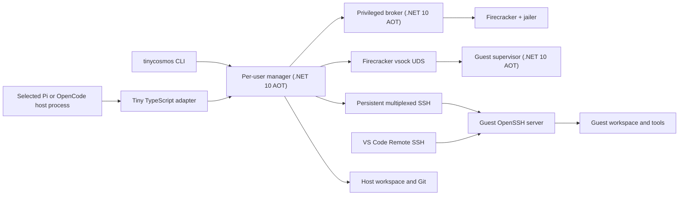

# Tiny Cosmos: MVP Technical Plan

## Status

This document is authoritative for the scope and implementation plan of the
first usable Tiny Cosmos vertical slice. [Current plan.md](Current%20plan.md)
describes the broader product direction.

Prepared on June 13, 2026. No implementation has started.

The harness adapter is split into two mutually exclusive candidate tracks: Pi
and OpenCode. The selection is deferred. Shared core work may proceed before the
choice, but the MVP will implement, package, test, and ship exactly one track.

## Decision summary

The MVP will target:

- Ubuntu 24.04 LTS host
- x86-64 with hardware virtualization and KVM
- Linux x86-64 guests
- Firecracker as the only hypervisor backend
- Either Pi or OpenCode as the only MVP harness integration, selected at the
  harness gate
- One primary VM per selected-harness session
- .NET 10 LTS with Native AOT for Tiny Cosmos services and command-line programs
- A small TypeScript adapter: a Pi extension or an OpenCode plugin
- OpenSSH as the ordinary guest command, PTY, file, and transfer transport
- A minimal guest supervisor used only for bootstrap and out-of-band management

The MVP will use disk-preserving idle stop. An idle VM is shut down while its
writable disks, group identity, sandbox identity, and metadata are retained.
The next guest-dependent operation starts the same sandbox and workspace again.
Firecracker memory snapshots are deferred until after the basic lifecycle is
reliable.

The MVP will not attempt Windows hosts, Windows guests, child VMs, project
template generation, comprehensive network policy, warm memory snapshots, or
general port publishing.

## Why this scope

The product has several independent hard problems: privileged VM setup, guest
execution, workspace transfer, harness interception, lifecycle recovery, IDE
access, and cross-boundary Git handoff. Supporting multiple hypervisors or
operating systems before one complete path works would multiply uncertainty at
every boundary.

Firecracker is the best fit for the first slice because it provides a narrow API,
a small Linux device model, virtio-vsock, and a production jailer. It supports
Linux hosts and Linux guests only, which is acceptable for this MVP but prevents
it from being the eventual universal backend.

Pi and OpenCode both expose TypeScript integration surfaces that can replace
guest-local tools while keeping the harness on the host. They differ in
project-resource controls, interactive shell interception, lifecycle events,
LSP/MCP behavior, and compatibility risk. Keeping those differences in
alternative adapter tracks allows the VM and manager architecture to advance
without prematurely selecting a harness or accidentally committing to shipping
both.

.NET 10 is the current LTS release and is supported until November 2028. Native
AOT is appropriate for the long-running manager and broker, the frequently
invoked CLI, and the small guest supervisor because it reduces deployment
dependencies, startup time, and idle memory. Native AOT is a build constraint,
not a reason to reproduce mature platform utilities such as SSH, SFTP, or PTY
handling in C#.

## MVP outcomes

A successful MVP demonstrates all of the following using the selected Pi or
OpenCode track:

1. Before the first guest-dependent operation for a harness session, the adapter
   gets or creates its sandbox group, then performs the operation against the
   returned immutable group identifier. The operation starts one isolated
   Firecracker VM.
2. The harness remains a non-root host process.
3. Harness shell and file tools operate on the guest workspace, not the host
   workspace.
4. The guest user can install packages, use passwordless `sudo`, and run Docker.
5. Two sessions started from the same host project receive independent
   workspaces, disks, processes, and manager-owned resources. MVP networking
   does not prevent access to reachable host, LAN, or sibling services.
   Same-user management clients remain mutually trusted.
6. The guest cannot directly mount or modify the host project.
7. Host-to-guest seeding and guest-to-host export are explicit operations.
8. Idle stop and later start preserve the guest filesystem.
9. A user can open the live guest workspace through VS Code Remote SSH.
10. A Git-backed guest workspace can be materialized as a new host-local branch
    and worktree, including tracked modifications and non-ignored untracked
    files.
11. Manager, broker, harness, or VM crashes are detected and reconciled without
    silently losing retained workspace disks.
12. All first-party .NET executables publish and run as warning-free Native AOT
    artifacts.

## Explicit non-goals

The following are outside the MVP:

- Windows host or guest support
- macOS support
- ARM64
- Cloud Hypervisor or another second backend
- Child VMs or multi-node sandbox groups
- GPU, device passthrough, or nested virtualization
- Warm memory-preserving snapshots
- Preserving running processes across idle stop
- Arbitrary inbound port publication
- Credential injection or credential brokering
- Project-specific image/template generation
- Agent-assisted template preparation
- Offline installation before required artifacts have been downloaded
- Full Git submodule, Git LFS, nested repository, or ignored-file preservation
- First-class guest LSP integration
- Sandbox-local MCP server injection
- Host-integrated formatter execution
- A graphical Tiny Cosmos application
- Hardened hostile multi-user hosting

The model uses distinct immutable group and sandbox identifiers from its first
commit. The MVP enforces exactly one current primary sandbox per live group.

## Supported host and installation

The supported MVP installation is a signed Debian package for Ubuntu 24.04 LTS.
It installs:

- Native AOT CLI, manager, broker, and guest-supervisor artifacts
- Pinned Firecracker and jailer binaries
- A systemd system unit and socket for the broker
- A systemd user unit and socket for the per-user manager
- The selected Pi extension or OpenCode plugin package
- Image manifests and image download/verification support
- Uninstall and orphan-resource cleanup commands

One-time installation requires root authority. Ordinary sandbox use must not
prompt for `sudo`.

Required host facilities are:

- KVM and read/write access arranged through the broker
- systemd
- cgroup v2
- iproute2
- nftables
- e2fsprogs
- `dnsmasq` or one other pinned DNS forwarder
- Git
- OpenSSH client tools
- ACL support for narrowly exposing the per-VM vsock endpoint

VS Code and its Remote SSH extension are optional until the intervention action
is used.

Before installation or VM creation, diagnostics check CPU virtualization, KVM,
supported host kernel, cgroup mode, required tools, available memory, and
available disk. A failed prerequisite produces a specific remediation message
instead of a partially created sandbox.

## System architecture



### Component responsibilities

| Component | Runtime | Native AOT | Responsibility |
|---|---|---:|---|
| `tinycosmos` CLI | .NET 10 | Yes | General same-user sandbox listing, inspection, debugging, lifecycle actions, execution, export, and IDE launch |
| Per-user manager | .NET 10 worker | Yes | Group-name lookup, immutable group and sandbox identity, state machine, leases, SSH connection management, workspace transfer, minimal guest control protocol, and persistence |
| Privileged broker | .NET 10 system service | Yes | Validated Firecracker launch, network namespaces, TAP devices, cgroups, and cleanup |
| Guest supervisor | .NET 10 Linux service | Yes | Boot linkage, readiness, SSH credential enrollment, host-key reporting, filesystem flush, and graceful shutdown |
| Guest OpenSSH server | Distribution package | Native | Multiplexed command execution, PTYs, SFTP, transfer streams, and VS Code Remote access |
| Selected harness adapter | TypeScript | No | Override guest-local built-in tools, derive logical group names, and disable intended local execution paths that cannot be redirected |
| Firecracker and jailer | Upstream Rust binaries | Native | VM implementation and process-level confinement |
| Image builder | Shell plus standard Linux tools | Not applicable | Produce kernel, initramfs, root image, and manifest |

### Process and privilege split

The per-user manager runs as the interactive user. It may read the user's host
workspace and Git repository using that user's ordinary permissions. It never
runs as root.

The broker is installed once as a root-owned system service. Its API exposes
domain operations rather than arbitrary host primitives:

- Allocate and remove a group network
- Create approved TAP and namespace resources
- Create approved writable disk files under broker-owned storage
- Launch a pinned Firecracker and jailer build with a validated configuration
- Query, signal, or terminate a VM owned by the authenticated user
- Reconcile and remove resources belonging to group and sandbox identifiers

The broker must reject arbitrary executable paths, command arguments, host
mounts, disk paths, network devices, kernel paths, and Firecracker JSON supplied
by a caller. Callers provide opaque image, profile, sandbox, and operation
identifiers. The broker constructs the final platform configuration.

The broker authenticates Unix socket clients with `SO_PEERCRED`, obtained through
a small source-generated P/Invoke. Filesystem permissions alone are not
sufficient for associating resources with a specific operating-system user.

The broker retains exclusive access to Firecracker's control API socket. After a
VM is configured and started, it grants the owning user connect-only access to
that VM's separate vsock Unix socket while keeping the containing directories
and all boot/disk artifacts non-writable. Losing or tampering with that endpoint
can break the owner's VM but cannot change Firecracker configuration or expose a
host path.

## Proposed repository structure

Only planning documents exist today. Implementation should begin with the
following ownership boundaries:

| Path | Purpose |
|---|---|
| `src/TinyCosmos.Cli` | Native AOT user CLI |
| `src/TinyCosmos.Manager` | Per-user daemon |
| `src/TinyCosmos.Broker` | Privileged Linux service |
| `src/TinyCosmos.Guest` | Guest supervisor |
| `src/TinyCosmos.Core` | State machine and domain types without platform I/O |
| `src/TinyCosmos.Protocol` | Versioned manager and minimal guest-control protocol contracts |
| `src/TinyCosmos.Linux` | Linux-specific system calls and Firecracker backend |
| `integrations/pi` | Candidate Pi extension and Pi compatibility tests; implemented only if Pi is selected |
| `integrations/opencode` | Candidate OpenCode plugin and OpenCode compatibility tests; implemented only if OpenCode is selected |
| `integrations/protocol` | Harness-neutral generated TypeScript protocol types and fixtures used by the selected adapter |
| `images/linux` | Reproducible image manifests and build automation |
| `tests` | Unit, contract, integration, recovery, and acceptance tests |

The future Windows backend should be a separate executable or compile-time
platform module. The core manager must not dynamically discover backend
assemblies because Native AOT does not support dynamic assembly loading.

## .NET and Native AOT policy

### Baseline

All first-party .NET projects target `net10.0`. Executables publish separately
for each supported runtime identifier, beginning with `linux-x64`.

Every shared library is treated as AOT-compatible from its first commit. The
build enables trimming, single-file, and AOT analyzers. CI treats actionable
trim and AOT warnings as failures.

Use:

- Source-generated `System.Text.Json` metadata
- Source-generated logging
- Source-generated regular expressions where regular expressions are needed
- `LibraryImport` source-generated native interop
- Explicit dependency registration
- Direct ADO.NET with `Microsoft.Data.Sqlite`
- `SafeHandle` wrappers for native handles

Avoid:

- Runtime assembly discovery or plugin loading
- `Reflection.Emit`
- Runtime-generated proxies
- MVC, OData, or reflection-based web frameworks
- EF Core in the MVP
- AutoMapper-style runtime mapping
- Unbounded reflection-based serialization
- Libraries that produce unresolved trim or AOT warnings

Native AOT output is platform-specific. Linux artifacts are built and tested on
Linux, and future Windows artifacts will be built and tested on Windows. A
single universal binary is not a goal.

### Practical AOT verification

Every pull request must:

1. Build and run normal framework-dependent unit tests.
2. Publish every executable with Native AOT.
3. Fail on new AOT or trimming warnings.
4. Run smoke tests against the published native binaries.
5. Run at least one guest-supervisor handshake using the published guest binary.

Release validation must use the same native artifacts that are packaged.

### Where pure .NET is impossible or impractical

| Area | Assessment | MVP decision |
|---|---|---|
| Harness adapter | Pure .NET is impossible in-process because both candidate harnesses load JavaScript or TypeScript integrations. | Keep the selected adapter thin; all policy and lifecycle logic remains in the .NET manager. |
| Firecracker and jailer | Reimplementing a VMM in .NET is out of scope and unsafe. | Package pinned upstream binaries and verify their digests. |
| Guest virtio-vsock listener | .NET has no first-class Linux `AF_VSOCK` endpoint API. | Use `LibraryImport` for the few required socket calls and wrap the resulting descriptor safely. Prove this in an early spike. |
| Guest commands, PTYs, and files | Reimplementing mature remote-shell, multiplexing, PTY, and file-transfer behavior would add a large guest protocol surface. | Use pinned OpenSSH client/server packages, multiplexed SSH sessions, SFTP, and standard guest utilities. |
| Linux network namespaces, TAP, nftables, and filesystem creation | These are possible through P/Invoke or netlink libraries, but implementing every kernel protocol in the MVP adds risk without product value. | The broker invokes fixed, absolute-path platform tools with generated arguments and no shell. Replace individual calls later only when useful. |
| Root filesystem and image construction | Writing filesystems, package installation, and initramfs generation in .NET is impractical. | Use reproducible shell/container build automation and standard distribution tools. |
| SQLite native library | The managed provider is AOT-capable, but SQLite remains native code and may be a packaged sidecar. | Accept a signed native SQLite dependency; do not promise a literally single-file installation. |
| Windows HCS later | Native AOT has no built-in COM support. | Call the HCS/HCN C APIs with `LibraryImport`; do not use WMI or built-in COM. This is not part of the MVP. |
| VS Code Remote SSH | VS Code, its extension, OpenSSH, and `ssh-keygen` are external products. | Detect them, manage scoped configuration, and report actionable missing prerequisites. |

If the guest vsock spike reveals unsafe handle integration or unacceptable
platform variance, the fallback is supervisor TCP on the sandbox-private
network. That fallback is acceptable for the MVP but must not silently become a
security claim.

## Control protocols

### Adapter and CLI to manager

The manager listens on a mode `0600` Unix domain socket below
`$XDG_RUNTIME_DIR/tiny-cosmos`. The TypeScript adapter and CLI use the same
versioned protocol.

Harness adapters are expected to generate most management API traffic, but the
protocol is independently usable by the CLI and other authorized clients. It
exposes Tiny Cosmos group and sandbox operations, not harness-specific
operations.

Every group has two distinct references:

- An immutable manager-assigned group identifier
- A mutable client-supplied logical group name

Every sandbox member has its own immutable manager-assigned sandbox identifier.
The MVP enforces one current primary sandbox per live group but keeps group and
sandbox identities separate.

A logical group name has the form `namespace:opaque`, is at most 512 encoded
UTF-8 bytes, and is compared using exact case-sensitive equality. The namespace
is lowercase ASCII. The non-empty opaque portion is percent-encoded UTF-8 as
needed. The manager validates shape and uniqueness within the authenticated
UID's namespace but does not interpret either portion. Names grant no authority.

Harness adapters use the harness session identifier without workspace-derived
identity:

```text
pi:<percent-encoded-session-id>
opencode:<percent-encoded-session-id>
```

The integration owns collision avoidance. Direct clients follow the same naming
contract.

The protocol exposes two distinct acquisition operations:

- `GetOrCreateGroup` atomically returns the group with the requested logical
  name or creates its group record, frozen network allocation, and primary
  sandbox before returning the immutable group identifier. Its request carries
  the creation metadata and selected defaults needed if the group is absent.
  When the group already exists, creation-only fields are not reapplied; mutable
  metadata changes use the separate metadata update operation. Compatible
  concurrent calls for the same name return the same group.
- `CreateGroup` always attempts creation. If the logical name already exists, it
  returns `NameConflict` and never aliases or returns the existing group as a
  successful creation. Its request carries the same required creation metadata
  as `GetOrCreateGroup`.

Logical names and mutable group metadata can be updated atomically by immutable
group identifier or current logical name. Renaming immediately releases the old
name and creates no alias. The host workspace path is mutable metadata used for
seeding, display, and export defaults; it is not identity. Where the selected
harness exposes a simple archive hook, nullable `archivedAt` metadata records
archive or unarchive without changing lifecycle.

Group metadata changes do not alter the immutable group identifier, sandbox
identifiers, disks, network allocation, member addresses, active operations,
leases, or SSH connections. The group owns one frozen network allocation, and
each sandbox member owns a frozen address within it.

The adapter-to-manager flow has two steps. When establishing the session
binding, the adapter calls `GetOrCreateGroup` with the session's logical name
and group-creation metadata, then receives the immutable group identifier. It
retains that identifier and issues subsequent operations against the existing
group without resending creation metadata. After adapter restart or loss of the
binding, it resolves the group through `GetOrCreateGroup` again.

All lifecycle, guest, transfer, export, metadata, and intervention operations
require an existing target. They never create a group, network allocation, or
primary sandbox. An unknown group or sandbox target returns a structured
`GroupNotFound` or `SandboxNotFound` error. A guest-dependent operation may
still start the existing stopped primary sandbox before performing its work.
Operation payloads contain the target and operation-specific inputs only; group
creation metadata is exclusive to `GetOrCreateGroup` and `CreateGroup`.

Operations use explicit tagged targets such as `{ "groupId": "..." }`,
`{ "logicalName": "..." }`, or `{ "sandboxId": "..." }`; they never infer
identity from string syntax. Direct sandbox-ID operations may target any active
member. Group-level execution conveniences resolve exactly the current primary
sandbox and never guess, promote, or substitute another member.

The manager serializes group acquisition and lifecycle transitions per target.
Compatible concurrent `GetOrCreateGroup` requests converge on the same group,
and compatible operations coalesce around the same startup work. Contradictory
lifecycle operations return a structured `LifecycleConflict`.

The protocol includes get-or-create, explicit create, start, stop, inspect, and
delete primitives, but detailed CLI command design and agent-facing lifecycle
tools are not MVP design priorities. Ordinary adapter use relies on the
get-or-create step followed by automatic start through guest-dependent
operations.

All clients authenticated as the same operating-system user share one group and
sandbox namespace and are assumed cooperative. Any of them may address,
inspect, mutate, stop, export, or delete any resource belonging to that user.
The manager does not enforce same-user creating-client ownership.

Use length-prefixed UTF-8 JSON envelopes with:

- Protocol version
- Request identifier
- Operation name
- Typed payload
- Success or structured error response
- Zero or more progress/output events associated with the request
- Explicit cancellation, plus request cancellation when the client disconnects;
  the manager signals guest work over a separate SSH channel rather than closing
  the SSH transport

Lifecycle progress is a structured event stream separate from guest stdout and
stderr. The manager guarantees state-change events such as preparing, starting,
waiting for supervisor, verifying SSH, and ready, plus structured terminal
startup errors. A harness adapter uses a native progress surface when available;
otherwise it may merge clearly prefixed synthetic progress lines into
model-visible tool output.

JSON metadata is source-generated in .NET. File-tool requests are text-oriented;
large seed and export transfers do not pass through the harness adapter.

The protocol is intentionally private in the MVP, but version negotiation,
capability negotiation, and structured errors are required from the beginning.
Operation names for general port publication, first-class guest LSP, and
sandbox-local MCP are reserved. MVP capability negotiation reports them as
unsupported, and calls return `UnsupportedOperation`.

### Manager to broker

The broker uses a separate root-owned Unix domain socket. It uses the same basic
framing but a distinct contract and stricter size limits. Each accepted
connection is bound to peer PID, UID, and GID before processing requests.

Operations are idempotent by operation identifier. A retried start, stop, or
delete must return the existing result rather than create duplicate host
resources.

### Broker to Firecracker

The broker uses Firecracker's HTTP API through its private Unix socket. The
Firecracker backend constructs configuration from typed internal models and a
small explicitly supported API surface. It does not expose arbitrary
Firecracker requests to the manager, harness adapter, CLI, guest, or agent.

### Manager to guest supervisor

Firecracker exposes host-initiated vsock connections through a Unix socket. The
manager connects to that socket, requests the fixed guest supervisor port, and
then speaks a small Tiny Cosmos control protocol.

The protocol supports only:

- Boot nonce, version, readiness, and capability negotiation
- Workspace-mount and SSH-service readiness reporting
- Installation, rotation, and revocation of sandbox-scoped SSH public keys
- Reporting the SSH endpoint and host-key identity
- Graceful filesystem flush and shutdown

It does not support command execution, PTYs, file operations, archive streams,
or arbitrary port relays. Control messages use source-generated JSON with
strict size limits; the protocol has no general bulk-data framing.

Each boot receives a random nonce used to prevent accidental connection to a
stale or wrong VM. This nonce does not protect against guest root, which is
already trusted to control its own guest.

### SSH guest data plane

After the control handshake, the manager verifies the SSH host-key identity
reported out of band and connects to the sandbox's frozen guest address using a
sandbox-scoped key. Ordinary guest work uses OpenSSH:

- SSH exec channels for commands, stdout, stderr, and exit status
- SSH PTY channels for interactive commands and terminal resizing
- SFTP for bounded file reads, writes, listing, and atomic replacement through
  temporary sibling files
- Standard guest tools such as `rg`, `find`, and `tar` for search, globbing,
  workspace seeding, and export streams

The manager maintains one or more persistent, multiplexed SSH connections for
harness and CLI work. Multiple concurrent commands and transfers use separate
channels over those connections; connection lifetime is not command lifetime.
VS Code Remote SSH may establish a separate persistent SSH connection to the
same sandbox.

Cancellation does not depend on closing an SSH connection or channel. When
practical, a command starts in its own process group and reports that group to
the manager. A cancellation or timeout sends a normal signal command over
another SSH channel. This is cooperative, best-effort guest behavior: guest root
can evade or replace any in-guest process-tracking mechanism. If SSH control is
unavailable or the guest does not stop the work, the reliable fallback is to
terminate the VM through the broker. The sandbox may then restart with its
retained disks or be explicitly recreated; Tiny Cosmos does not add a stronger
in-guest job-containment subsystem.

## VM storage model

### Immutable image artifacts

The single official MVP image consists of:

- A pinned Firecracker-compatible Linux kernel
- A small initramfs
- A read-only ext4 root image
- The Native AOT guest supervisor
- Git, OpenSSH server, `ripgrep`, archive utilities, certificate roots, and basic
  diagnostics
- Docker Engine and the kernel features needed by Docker
- An `agent` user with passwordless `sudo`
- A machine-readable manifest with versions and SHA-256 digests

The image should be based on one Ubuntu 24.04 LTS userspace. The exact kernel
version must be selected from Firecracker's supported kernel policy and pinned
with the Firecracker release.

### Per-sandbox disks

Each sandbox receives:

- A sparse ext4 system-state disk
- A sparse ext4 workspace disk

The initramfs mounts the immutable root as an overlay lower layer and uses the
system-state disk for the overlay upper/work directories. Persistent home
content and Docker data live directly on the system-state ext4 filesystem so
Docker does not place overlayfs on top of another overlayfs mount.

The workspace disk is mounted at `/workspace`. Its conventional project root is
`/workspace/<project-name>`.

This design avoids cloning the full root image and works on ordinary ext4 host
filesystems without requiring reflinks, LVM thin provisioning, or qcow2 support.
The broker may use standard `truncate` and `mkfs.ext4` tools to create sparse
disks. It never mounts a guest filesystem into the host during normal operation.

Default resources should begin at 2 vCPU, 4 GiB RAM, a 12 GiB sparse system
disk, and a 32 GiB sparse workspace disk. Profiles may be added later; the MVP
can expose only a small, bounded override.

## Networking

The broker creates one Linux network namespace per sandbox group. The namespace
contains:

- A bridge prepared for the primary VM and future children
- One TAP device for the primary VM
- A veth connection to the host namespace
- Static addressing allocated by the manager
- NAT for outbound internet access
- A small broker-managed DNS forwarder using the host's current resolvers

The group owns this network allocation for its lifetime. Each sandbox member
receives a frozen address within it. Renaming the logical group or updating
other metadata has no effect on network resources.

The MVP does not install policy intended to isolate guests from reachable host,
LAN, VPN, metadata, or sibling-sandbox services. Per-group namespaces organize
and account for resources but are not a network security claim. This limitation
is documented rather than presented as a routine runtime warning.

Host, LAN, metadata, VPN, and sibling filtering, IPv6 policy, egress controls,
and network kill switches are deferred to the production networking phase.

General port publication is deferred. The host-to-guest SSH endpoint is a
managerial transport on the frozen sandbox address, not a general publication
mechanism. Harness/CLI traffic and VS Code Remote may use separate persistent
SSH connections.

## Guest execution model

The guest supervisor starts as root and listens only on virtio-vsock. It
establishes boot linkage, enrolls the sandbox-scoped SSH key, reports the SSH
host-key identity, and reports readiness. It does not execute ordinary agent
commands.

Normal selected-harness commands run through OpenSSH as the `agent` user. The
user has passwordless `sudo` and access to Docker, so this is an ergonomics
default rather than a security boundary.

Each command receives:

- An argument vector or an explicit shell command
- Guest working directory
- Environment additions and removals
- Optional timeout
- Optional PTY dimensions
- Output limits and truncation metadata

Non-interactive commands use SSH exec channels. Interactive commands use SSH PTY
channels. The manager reuses persistent multiplexed SSH connections and may run
multiple commands concurrently on separate channels.

When practical, a small shell wrapper uses standard guest process-group
facilities and returns the group identifier. Cancellation or timeout opens
another SSH channel and uses a standard signal command against that group; it
does not involve the supervisor or a resident job service. Cancellation is an
ergonomics feature, not a containment boundary, and a successful SSH request
does not prove that guest root left no descendant running. Closing the command
channel or losing the underlying SSH connection is not treated as cancellation.

If command control is lost, the manager can force-stop Firecracker through the
broker. This is the only reliable way to stop all guest execution. A later
operation can restart the same retained disks, while an explicit recreate
operation replaces a sandbox whose guest state is no longer useful.

File operations use SFTP and standard guest tools. Writes use a temporary
sibling followed by atomic rename where the target filesystem permits it.
Reads and searches have explicit byte, line, result, and time limits. Tool
responses distinguish an empty result from truncation.

## Harness integration

The Pi and OpenCode tracks share one adapter contract. The selected TypeScript
adapter:

- Derives a logical group name from the harness-owned session identifier and
  supplies it to the management API. Pi uses `pi:<session-id>` and OpenCode uses
  `opencode:<session-id>`, percent-encoding the identifier as needed.
- Calls `GetOrCreateGroup` for that logical name, receives the immutable group
  identifier, and then sends each guest-dependent operation against the
  existing group's primary sandbox. The operation may start a stopped sandbox
  but never creates a group.
- Preserves the selected harness's expected argument, result, rendering,
  cancellation, timeout, and path semantics while forwarding execution to the
  per-user manager.
- Resolves relative paths under the guest project root and treats absolute paths
  as guest paths.
- Keeps model access, conversation state, memory, web operations, trusted
  harness-global integrations, user questions, and task tracking in the host
  harness.
- Prevents project-provided executable configuration from running in the host
  harness process.
- Audits every intended replacement tool and interactive shell path. If any
  intended Tiny Cosmos path cannot function through the manager, the integration
  disables itself with a clear error.

Host reads required for explicit seed input, user-selected attachments, or
harness-owned rules may remain host operations. Undocumented automatic host
writes or local command execution are release blockers unless they can be
disabled or redirected.

Unknown future harness-native tools are governed by the trusted harness and its
permission model. Tiny Cosmos does not claim to intercept tools it has not
adopted into its intended replacement surface.

The harness spikes use a block-first profile for project-provided plugins,
hooks, LSPs, MCP commands, formatters, and related executable resources. They
record practical workflow breakage. The harness selection gate finalizes any
exceptions; the MVP default remains blocked unless that decision explicitly
changes it.

### Pi MVP track

Pi extensions are JavaScript or TypeScript modules. Registering a tool with a
built-in name replaces the built-in registration. The Pi adapter implements the
exported operation interfaces used by Pi's built-in tool constructors and
registers manager-backed replacements for:

- `read`
- `write`
- `edit`
- `bash`
- `grep`
- `find`
- `ls`

The replacements retain Pi's built-in schemas, metadata, and rendering. The
extension handles `user_bash` for interactive `!` and `!!` commands, returns the
guest result, and prevents Pi's default host execution.

The adapter derives `pi:<percent-encoded-session-id>` from `getSessionId()`.
The canonical working directory is mutable group metadata, not identity.
Ordinary session presence does not hold an active lease. Startup, reload, new,
and resume events preserve the logical group name according to Pi's session
semantics. Before the first guest-dependent operation, the adapter gets or
creates the group; the operation then starts its existing primary sandbox if
needed.

Pi session deletion destroys the group and its resources. If Pi exposes a simple
archive or unarchive hook, the adapter updates `archivedAt` metadata without
stopping or deleting the group. A session fork creates a new logical name and
new group, primary sandbox, and network identifiers after the manager performs a
full-state fork.

The preferred managed launch profile disables discovered extensions and
built-in tools, explicitly loads only the Tiny Cosmos extension, and lets that
extension register the approved manager-backed tool set. It also disables
project skills, prompt templates, themes, context files, and approval of
project-local resources. Trusted harness-global extensions may be loaded only
through explicit manager-owned configuration and their host behavior must be
covered by conformance tests.

The initial profile uses `--no-extensions`, `--no-builtin-tools`,
`--no-skills`, `--no-prompt-templates`, `--no-themes`, `--no-context-files`,
and `--no-approve`, with the Tiny Cosmos extension supplied explicitly through
`-e`.

Pi core has no built-in MCP client in the reviewed snapshot. Sandbox-local MCP
and a guest LSP tool are deferred. An extension-owned MCP client or LSP tool can
be added later without changing the manager protocol.

### OpenCode MVP track

OpenCode plugins are JavaScript or TypeScript modules, and a plugin tool with the
same name as a built-in tool takes precedence. The OpenCode adapter uses that
mechanism to replace:

- `bash`
- `read`
- `write`
- `edit`
- `grep`
- `glob`
- `apply_patch`

The plugin derives `opencode:<percent-encoded-sessionID>` from the OpenCode
`sessionID`. Directory and worktree paths are mutable group metadata, not
identity. Before the first guest-dependent operation, the adapter gets or
creates the group; the operation then starts its existing primary sandbox if
needed.

OpenCode session deletion destroys the group and its resources. If OpenCode
exposes a simple archive or unarchive hook, the adapter updates `archivedAt`
metadata without lifecycle effects.

Tiny Cosmos launches OpenCode with `OPENCODE_DISABLE_PROJECT_CONFIG=true`.
Project-provided OpenCode plugins, local MCP commands, LSP commands, formatters,
and related configuration must not execute in the trusted host process. Tiny
Cosmos may inspect that configuration as untrusted input and selectively offer
equivalent behavior inside the guest later.

The Tiny Cosmos OpenCode config hook sets `lsp` and `formatter` to `false` and
disables any other automatic local process execution that has not been
redirected. The agent can install and invoke LSPs, linters, type checkers, or
formatters inside the guest through the shell.

Any user-entered shell path separate from the model-facing `bash` tool must be
redirected through the manager or disabled in the Tiny Cosmos launch profile.

OpenCode v1.17.4 caches LSP and MCP state by workspace directory rather than by
session. Its LSP client also reads host files and sends host paths. Directly
injecting a guest LSP command or MCP proxy is therefore not safe for two
sessions from the same host project.

First-class guest LSP and sandbox-local MCP integration remain deferred. A
post-MVP OpenCode track may add a session-aware dynamic-tool provider during
per-step tool resolution or use a namespaced, default-deny compatibility proxy
with execution-time ownership checks. See
[OpenCode sandbox LSP and MCP feasibility.md](OpenCode%20sandbox%20LSP%20and%20MCP%20feasibility.md).

### Harness selection gate

The harness choice may remain open while the shared manager, broker, guest,
image, and protocol foundations are built. It must be made before Phase 4.

Selection uses a pinned-version spike for each candidate that remains under
consideration. The recorded evidence covers:

1. Complete guest-local tool replacement with normal model-facing results.
2. Prevention of unintended host file, shell, formatter, LSP, MCP, extension,
   and helper-process execution.
3. Two isolated sessions from one host project.
4. Two-step group acquisition and operation, start, fork, archive where
   available, deletion, restart, and shutdown behavior.
5. Interactive command and cancellation behavior.
6. Packaging, launch, and supported-version upgrade complexity.

After selection, only the chosen adapter is implemented and packaged for the
MVP. The other track moves to post-MVP work. Shared .NET domain and protocol
projects must not contain Pi- or OpenCode-specific types or session semantics.

An unsupported harness version may continue with a clear degraded or unverified
warning while using the known adapter behavior. If any intended replacement
tool or interactive shell path is missing, bypasses the manager, or cannot be
disabled, the Tiny Cosmos integration disables itself rather than offering a
partial intended tool surface.

## Workspace seeding

The per-user manager, not the broker, reads host project files.

### Git workspace

For a Git repository:

1. Resolve the canonical repository, worktree, current commit, and working-tree
   status with the host Git executable.
2. Create a temporary Git bundle containing the current commit and required
   reachable history.
3. Stream the bundle to the guest and clone it into the guest project root.
4. Overlay tracked working-tree changes and non-ignored untracked files.
5. Record the host repository identity, seed commit, and a digest of the imported
   dirty-state manifest.
6. Remove temporary host and guest transfer artifacts.

This avoids copying a `.git` file that points outside a host worktree and avoids
placing host credential-helper configuration directly into the guest.

Ignored files are excluded by default. The MVP refuses or warns clearly for
submodules, nested repositories, and Git LFS pointer/content states it cannot
preserve accurately.

### Non-Git workspace

For a non-Git directory, stream a tar archive that:

- Does not follow symlinks outside the source root
- Preserves regular files, directories, executable bits, and symlinks
- Rejects device nodes, sockets, and other special files
- Records a manifest and digest for later comparison

Compression is optional for local transfer and should be omitted initially if
it makes cancellation or error recovery harder.

## Git worktree handoff

The MVP handoff preserves the guest's current file state while leaving the new
host worktree dirty in the same broad sense. Exact staging state is not
preserved.

The flow is:

1. Acquire an export lease and verify the guest repository.
2. Capture the guest `HEAD` and create a Git bundle containing any commits not
   present in the host repository.
3. Produce a binary-capable diff from `HEAD` to the current working tree.
4. Archive non-ignored untracked files.
5. Transfer the bundle, diff, archive, and manifest to a user-owned temporary
   host directory.
6. Validate repository identity and import missing objects under a temporary
   Tiny Cosmos ref.
7. Create a collision-safe host branch and sibling worktree at guest `HEAD`.
8. Apply the diff and extract untracked files without following unsafe paths.
9. Verify that the resulting worktree manifest matches the exported manifest.
10. Remove the temporary ref and transfer directory after successful validation.

Suggested branch names use `tiny-cosmos/<project>/<date>-<short-sandbox-id>`.
Suggested worktree directories use a sibling
`<repository>-tiny-cosmos-<short-sandbox-id>` name.

The operation never merges into an existing branch and never updates an existing
worktree in the MVP. Repeating handoff creates another branch/worktree.

## Lifecycle and persistence

### Durable state

The manager stores state in a per-user SQLite database below
`$XDG_DATA_HOME/.tiny-cosmos`. Use direct parameterized SQL and explicit schema
migrations rather than EF Core.

Persist at least:

- Immutable group and sandbox identifiers
- Owner UID
- Logical group name, unique within the owner UID namespace
- Mutable host workspace path and optional Git metadata
- Optional `archivedAt` metadata when supported by the selected harness
- Current primary sandbox identifier and retired member history
- Optional parent group identifier for fork provenance
- Guest project path
- Image and Firecracker versions
- Resource allocation
- Desired and observed lifecycle state
- Broker resource identifiers
- Disk identifiers and sizes
- Group network allocation and per-sandbox frozen addresses
- Last activity timestamp and optional stop reason
- Last successful supervisor handshake and SSH verification
- Failure category and recovery guidance

Logs are not the source of truth. Sensitive file content, command content, and
credentials do not belong in the state database.

### State model

The durable lifecycle states are:

- `Preparing`
- `Starting`
- `Ready`
- `Stopping`
- `Stopped`
- `Failed`
- `Deleting`
- `Deleted`
- `Retired`

`Busy` is derived from active leases and is not a separate durable VM state.
`Stopped` covers both explicit stop and disk-preserving idle stop; an optional
reason distinguishes them for diagnostics. Execution state belongs to sandbox
members, not groups.

Every transition records desired state, observed state, operation identifier,
and last error. Startup reconciles database state with broker-owned processes,
network resources, disks, and guest readiness before accepting new operations.

Guest-dependent operations automatically start an existing stopped sandbox.
This includes process execution, guest file operations, transfers, export
capture, transport health checks, and VS Code access. Metadata, offline
inspection, and deletion do not start a sandbox. No operation in this set
creates a missing group.

Compatible requests against `Preparing` or `Starting` join the existing
lifecycle operation and retain their own cancellation and result handling.
Explicit start of `Ready` returns `AlreadyRunning` or `NotModified`. Start or
guest-dependent work during `Stopping` returns `LifecycleConflict`. `Failed`,
`Deleting`, `Deleted`, and `Retired` reject start.

Automatic start may adopt an already-running VM after a valid supervisor
handshake and SSH verification. The manager invariant is that an existing VM
process is either valid and adoptable or has already been terminated after
control or data-plane verification failure. Neither automatic nor explicit
start launches a duplicate process.

Start succeeds only after boot-nonce validation, protocol negotiation,
workspace mounting, supervisor readiness, SSH host-key verification, and a
successful SSH data-plane probe. The client controls its readiness wait and
defaults to 30 seconds. Client timeout, cancellation, or disconnect discards
that pending command or operation but does not cancel startup.

The manager continues startup in the background to avoid repeated stop/start
thrashing. It enforces a separate configurable hard startup limit, defaulting to
five minutes. Reaching the limit force-terminates the VM, records a transient
startup-timeout error, and restores the prior `Stopped` state. A start request
makes one attempt and performs no automatic retry.

Only nonrecoverable corruption, invalid configuration, or irreconcilable
ownership transitions a sandbox to durable `Failed`. Transient capacity,
dependency, or startup-timeout errors leave it stopped and retryable.

Lifecycle progress uses structured state-change events separate from guest
stdout and stderr. The manager emits preparing, starting, waiting for
supervisor, verifying SSH, and ready transitions plus structured terminal
startup errors. Only the nonrecoverable cases described above emit a durable
`Failed` transition. If a harness has no native progress surface, its adapter
may render clearly prefixed synthetic lines in tool output.

### Leases

The manager issues leases for:

- Commands
- File and workspace transfers
- Git export
- VS Code SSH connection
- Explicit user pinning

Merely keeping a harness session open does not hold a lease. Idle stop begins
after 15 minutes with no lease. New work during `Stopping` returns
`LifecycleConflict`; the manager does not infer intent by reversing or
sequencing contradictory operations.

### Disk-preserving stop and start

For the MVP:

1. Stop accepting new guest operations.
2. Ask the supervisor to flush filesystems and shut down cleanly.
3. Wait for Firecracker exit.
4. Force termination after a bounded timeout.
5. Retain system and workspace disks, metadata, and network allocation.
6. Mark the sandbox `Stopped` only after process exit is observed.

Start launches a fresh Firecracker process with the same disks and waits for a
new supervisor nonce, readiness report, and verified SSH data plane. If
background startup completes after all waiting clients have left, readiness
begins a fresh 15-minute idle period.

Warm Firecracker snapshots are deferred because snapshot compatibility depends
on Firecracker version and CPU features. Disk-preserving stop and start prove
the product continuity contract without binding retained sessions to fragile
memory images.

### Fork, replacement, deletion, and retention

A harness session fork creates a new immutable group identifier, logical group
name, primary sandbox identifier, and frozen network allocation. It records the
parent group identifier only as provenance. A full-state fork acquires an
exclusive operation, cleanly stops the parent, sparse-copies both persistent
disks, starts the parent again, and then starts the independent child.

An unbootable or corrupted primary sandbox becomes `Failed`. Tiny Cosmos never
mounts or repairs its filesystems on the host and never runs host-side `fsck`.
Failed disks remain inert until cleanup.

Replacement creates a new primary sandbox identifier within the same immutable
group and retains the failed sandbox as a `Retired` historical member that
cannot start. The replacement uses the current mutable host workspace path as a
fresh seed and reports that guest-only changes were not recovered. The logical
group name, group identifier, and network allocation remain unchanged.

Deleting a harness session deletes its group and all group resources.
Harness archive is non-destructive; when a simple hook exists, it only sets or
clears `archivedAt`.

The MVP never automatically deletes stopped, failed, retired, or archived
groups. Under disk pressure, the client offers explicit cleanup. Bulk cleanup
selects groups idle longer than a user-supplied duration, previews matching
groups and estimated reclaimed space, requires confirmation, supports an
explicit noninteractive confirmation option, and excludes running or leased
sandboxes.

Post-MVP work may add weak retention priority so inactive or archived sessions
become earlier candidates under resource pressure. Exact heuristics are not
part of this plan.

## VS Code intervention

The guest image includes OpenSSH server. When the user requests **Open in VS
Code**, the manager:

1. Starts the existing sandbox automatically if needed and acquires an IDE
   lease.
2. Creates or reuses a sandbox-scoped IDE SSH keypair and known-host entry.
3. Asks the supervisor to install the IDE public key for the `agent` user and
   verifies the reported host-key identity.
4. Writes a managed, clearly delimited SSH host entry for the sandbox's frozen
   guest address.
5. Configures a VS Code-specific persistent multiplexing control path, separate
   from the manager's harness/CLI SSH transport.
6. Invokes the VS Code CLI with the Remote SSH authority and guest project path.
7. Holds the lease while that SSH control connection exists, with a bounded
   `ControlPersist` grace period after its last channel closes.

Keys, host aliases, and known-host data are scoped to Tiny Cosmos and removed
when the sandbox is deleted. The manager must not disable host-key checking
globally, edit unrelated SSH configuration, or assume that the harness and VS
Code share one SSH connection.

If VS Code, OpenSSH, or the Remote SSH extension is unavailable, the action
returns a precise prerequisite error and leaves the sandbox running.

## Image production and updates

The MVP image build is deterministic enough to reproduce from:

- Base distribution snapshot identifier
- Package list and versions
- Kernel source/configuration and digest
- Guest supervisor artifact digest
- Image build scripts
- Firecracker compatibility manifest

The release process signs or otherwise authenticates a manifest that covers all
boot artifacts. The broker launches only registered artifacts whose digest
matches that manifest.

Image updates create a new immutable image identifier. Existing stopped
sandboxes remain pinned to their original image. Automatic rebasing of writable
disks is not attempted.

Project templates and agent-assisted image preparation are post-MVP. The MVP
ships one authenticated Ubuntu 24.04 userspace image and proves only its build,
distribution, verification, disk, seed, and cleanup loop.

## Observability and supportability

All .NET components use structured logs with:

- Correlation, operation, immutable group, sandbox, and logical-name digest
  identifiers
- Lifecycle transition and duration
- Firecracker exit status
- Guest supervisor protocol version, SSH verification, and disconnect reason
- Byte counts and truncation flags
- Cleanup and reconciliation results

Do not log file content, environment values, full command text, SSH private keys,
or guest tokens by default.

The CLI provides a diagnostic bundle containing versions, sanitized state,
recent structured logs, host capability checks, and broker reconciliation
results. Diagnostic collection must be reviewable before sharing.

The broker runs a watchdog for unresponsive Firecracker processes and preserves
enough exit information to distinguish guest failure, VMM failure, timeout, and
administrative termination.

## Delivery sequence

### Phase 0: risk spikes

Complete disposable prototypes and record results for:

1. Launching Firecracker through the jailer from a narrow root broker.
2. Creating a per-group namespace/TAP/NAT path that permits internet access and
   preserves frozen group and sandbox addressing.
3. Running a minimal .NET 10 Native AOT guest supervisor over Firecracker vsock
   and enrolling a sandbox-scoped SSH key.
4. Maintaining multiplexed SSH transport with concurrent exec, PTY, SFTP, and
   cancellation channels, plus a separate VS Code SSH connection.
5. Booting Docker and running a container inside the guest.
6. Disk-preserving stop and start with the overlay-root and workspace disks.
7. Git bundle seed and dirty worktree handoff.

Each spike must have an explicit pass/fail note. A failed spike changes the plan
before product code grows around an assumption.

### Phase 1: AOT foundation

- Create the solution and project boundaries.
- Establish analyzers, formatting, test, publish, and packaging pipelines.
- Define domain identifiers, errors, state transitions, and protocol envelopes.
- Implement capability diagnostics for KVM, cgroup v2, required host tools, and
  supported kernel/CPU.
- Produce the first signed image manifest and boot artifacts.

Exit criterion: all .NET executables Native AOT publish with no actionable
warnings and the image boots manually.

### Phase 2: broker and VM lifecycle

- Implement peer-authenticated broker IPC.
- Add approved storage, namespace, TAP, NAT, cgroup, jailer, and Firecracker
  operations.
- Add idempotent start, inspect, stop, force-stop, and delete.
- Implement manager persistence and startup reconciliation.

Exit criterion: the unprivileged CLI can safely create, inspect, stop, start,
and delete one VM without accepting arbitrary privileged inputs.

### Phase 3: guest linkage, execution, and files

- Implement minimal vsock negotiation, SSH credential enrollment, host-key
  reporting, readiness, and graceful shutdown.
- Add persistent multiplexed SSH connection management.
- Add non-interactive and PTY execution, output limits, timeout, and
  best-effort cancellation through separate SSH channels.
- Add SFTP-backed file operations and SSH-streamed `grep`, glob, patch, and tar
  operations.

Exit criterion: the CLI can perform all guest-local operations needed by the
future selected harness adapter without routing ordinary work through the guest
supervisor.

### Harness selection checkpoint

- Run or refresh the pinned-version Pi replacement spike if Pi remains under
  consideration.
- Run or refresh the pinned-version OpenCode replacement spike if OpenCode
  remains under consideration.
- Compare tool fidelity, host-execution suppression, lifecycle behavior,
  packaging, upgrade risk, and user experience using
  [Harness integration comparison.md](Harness%20integration%20comparison.md).
- Record the selected track and pin its supported harness version before Phase
  4 begins.

Exit criterion: exactly one of Pi or OpenCode is selected for the MVP, with
pass/fail evidence for its tool replacement and host-process safety assumptions.

### Phase 4: workspace and first vertical slice

- Implement Git and non-Git seeding.
- Add immutable group and sandbox identifiers plus UID-scoped logical group
  names and mutable metadata.
- Add atomic `GetOrCreateGroup` and explicit `CreateGroup` operations.
- Add concurrent get-or-create convergence, duplicate explicit-create
  rejection, and not-found behavior proving that ordinary operations never
  create groups.
- Add two-session filesystem, process, disk, and control-plane isolation tests.

#### Pi track

- Implement the TypeScript Pi extension using Pi's built-in operation
  interfaces.
- Replace `read`, `write`, `edit`, `bash`, `grep`, `find`, and `ls`.
- Intercept `user_bash`.
- Launch Pi with discovered project resources and unapproved extensions
  disabled.
- Translate Pi session identity, fork, archive where available, and deletion
  events into logical-name, metadata, group-fork, and group-deletion operations.

#### OpenCode track

- Implement the TypeScript OpenCode plugin.
- Replace `bash`, `read`, `write`, `edit`, `grep`, `glob`, and `apply_patch`.
- Launch OpenCode with project configuration discovery disabled.
- Disable unredirected host LSP and formatter execution in the integration
  profile.
- Translate OpenCode session identity, archive where available, and deletion
  events into logical-name, metadata, get-or-create, and group-deletion
  operations.

Only the selected subsection is implemented.

Exit criterion: two sessions in the selected harness can independently edit and
build the same seed project without changing the host workspace.

### Phase 5: continuity and recovery

- Add activity leases and idle detection.
- Implement 15-minute idle stop and automatic start for guest-dependent
  operations.
- Add structured startup progress, client-controlled readiness waits, and the
  five-minute manager hard startup limit.
- Reconcile manager, broker, Firecracker, network, and disk state after crashes.
- Add full-state group fork, failed-primary replacement, retired history, and
  explicit group deletion.
- Add non-destructive archive metadata and confirmed bulk cleanup by idle age.
- Add watchdog and failure diagnostics.

Exit criterion: repeated idle stop/start and forced-crash tests preserve
workspace state and leave no unowned processes or network resources.

### Phase 6: intervention and handoff

- Implement the separate VS Code Remote SSH connection and scoped SSH
  configuration.
- Implement Git worktree handoff and manifest verification.
- Add non-Git selected-file/artifact export if needed for acceptance.

Exit criterion: the user can inspect the live VM and separately create a usable
host worktree from its current Git state.

### Phase 7: hardening and release gate

- Complete security, fault-injection, resource-limit, and upgrade tests.
- Pin and authenticate all external binaries and image artifacts.
- Test install, uninstall, and cleanup on a fresh supported host.
- Produce operator and troubleshooting documentation.

Exit criterion: the complete acceptance scenario passes using packaged Native
AOT artifacts on a clean host.

## Test strategy

### Unit and contract tests

- Lifecycle transition legality and idempotency
- Lease accounting and idle-stop races
- Compatible startup coalescing and conflicting stop/start requests
- Client timeout discarding a command so it never executes later while manager
  startup continues
- Hard startup timeout restoring `Stopped`
- Path translation and archive validation
- Git status and export policy
- Protocol versioning, framing, limits, and malformed inputs
- Protocol schemas keeping group-creation metadata out of ordinary operations
- UID-scoped group and sandbox listing and inspection
- Immutable group and sandbox identifiers
- Exact logical-name lookup, syntax, 512-byte limit, and UID-scoped uniqueness
- Get-or-create returning an existing group or atomically creating one
- Duplicate explicit creation returning `NameConflict`
- Unknown operation targets returning not-found without group creation
- Logical-name and workspace metadata changes preserving all immutable resource
  identifiers
- Concurrent get-or-create calls converging on one immutable group
- Group fork identity and failed-primary replacement history
- Broker request validation
- Firecracker configuration generation
- SQLite migrations and crash-safe updates

The selected TypeScript adapter and .NET manager share checked-in protocol
fixtures so wire compatibility is tested without relying on generated
implementation behavior.

### KVM integration tests

Run on dedicated self-hosted Linux runners with KVM:

- Boot and readiness
- Persistent SSH reuse with concurrent exec, cancellation, timeout, PTY, and
  large-output truncation channels
- Separate simultaneous harness/CLI and VS Code SSH connections
- SFTP file operations and large SSH-streamed workspace transfer
- Docker container execution
- Internet access through each group's NAT path
- Disk-full and memory-pressure behavior
- Graceful and forced shutdown
- Idle stop, automatic start, progress events, and background startup after
  client timeout
- Full-state fork with independent group, sandbox, network, and disk identities
- Failed-primary replacement without host-side filesystem repair
- Firecracker, manager, broker, and supervisor crash recovery
- Failed in-guest cancellation followed by broker force-stop and restart
- Cleanup after partial creation

### Security tests

Attempt to:

- Supply arbitrary kernel, disk, executable, namespace, and host paths
- Inject Firecracker arguments or shell metacharacters
- Use symlink/path replacement races during import and export
- Connect to or delete another operating-system user's resources
- Reuse stale operation identifiers, boot nonces, or SSH credentials
- Substitute an SSH host key that does not match the supervisor's out-of-band
  report
- Escape archive roots during seed or handoff
- Keep resources alive after sandbox deletion
- Cause logical-name or metadata changes to rebind disks, networking, active
  commands, or SSH connections

Firecracker/KVM escape resistance is inherited from the selected upstream
components and host patching; Tiny Cosmos tests its confinement configuration,
not the hypervisor implementation itself.

The security suite does not expect denial between management clients running as
the same UID. It also does not expect guest-network denial of reachable host,
LAN, VPN, metadata, or sibling services. Separate tests confirm that same-user
clients can operate each other's resources and that duplicate explicit logical
names are rejected rather than aliased.

### Harness compatibility tests

For every supported version of the selected harness:

- Confirm every enabled model-facing shell and file operation modifies only the
  guest.
- Confirm trusted harness-global operations remain in the harness.
- Confirm project-defined executable resources cannot run on the host.
- Confirm interactive user-shell paths cannot bypass the guest.
- Confirm cancellation uses a separate SSH channel rather than transport
  disconnect and reports when best-effort guest signaling fails.
- Confirm the adapter derives the same logical group name from the harness
  session identifier after restart and resume.
- Confirm failure of any intended replacement tool or interactive shell path
  disables the integration with a clear error.
- Detect additions or signature changes to intended built-in local tools.
- Treat unknown future harness-native tools as harness-governed rather than
  claiming Tiny Cosmos interception.
- Audit non-tool filesystem access and helper-process execution.

#### Pi track

- Confirm same-name extension registrations replace Pi built-ins.
- Confirm every logical group name begins with `pi:`.
- Confirm the managed launch profile loads the explicit Tiny Cosmos extension
  while suppressing discovered project extensions, skills, prompts, themes, and
  context files.
- Confirm `user_bash` returns guest output and prevents default host execution.
- Confirm session identity, fork, optional archive, deletion, and first
  guest-operation behavior preserve group ownership and the two-step
  get-or-create then operation flow.

#### OpenCode track

- Confirm same-name plugin tools take precedence.
- Confirm every logical group name begins with `opencode:`.
- Confirm `OPENCODE_DISABLE_PROJECT_CONFIG=true` blocks project configuration.
- Confirm project-defined plugins, LSP commands, MCP commands, and formatters
  cannot execute on the host.
- Confirm disabled LSP and formatter paths cannot execute on the host.
- Confirm session identity, optional archive, deletion, and first-tool behavior
  preserve group ownership and the two-step get-or-create then operation flow.

Only the selected subsection is release-gating.

## Release acceptance scenario

On a clean supported host:

1. Install Tiny Cosmos and complete the one-time privileged broker setup.
2. Open one Git project in the selected Pi or OpenCode harness and start two
   sessions.
3. Observe two independent Firecracker VMs and two independent guest workspaces.
4. In both sessions, run shell commands, edit files, install a package with
   `sudo`, build the project, and run a Docker container.
5. Make conflicting edits and verify neither session changes the host project or
   the other guest through guest execution.
6. Use the same-user CLI to inspect both immutable group and sandbox identifiers
   and resolve each current logical group name.
7. Rename one logical group and change its host workspace metadata while it is
   running; verify its IDs, VM, disks, network allocation, active command, and
   VS Code SSH connection remain unchanged and the old name is immediately
   reusable.
8. Let one session become idle and verify its VM process exits while disks remain.
9. Return to it and verify structured startup progress and the same files after
   automatic start.
10. Open that sandbox in VS Code Remote SSH and edit the live guest workspace.
11. Export it to a new host worktree and verify committed guest history, tracked
    changes, and non-ignored untracked files.
12. Fork a harness session and verify new group, sandbox, network, and disk
    identities with independent state.
13. Start a new selected-harness session from the exported worktree and verify
    it receives a new independent group.
14. Simulate a nonrecoverable primary failure, replace it in the same group,
    and verify the failed member becomes retired while the replacement seeds
    from current host state.
15. Archive and unarchive a session where the harness supports a simple hook;
    verify metadata changes without deletion. Delete the session and verify its
    group is destroyed.
16. Delete all remaining groups and verify VM processes, disks, namespaces, TAP
    devices, SSH control connections, SSH entries, and database records are
    removed.
17. Repeat key steps after forcibly terminating the manager and one Firecracker
    process to verify recovery.

## Main risks and fallback decisions

| Risk | First response | Accepted fallback |
|---|---|---|
| .NET guest vsock integration is unreliable | Isolate and fix the small native interop layer. | Use supervisor TCP on the per-group guest network for MVP without treating that network as a security boundary. |
| Overlay-root conflicts with Docker | Keep Docker data on a direct ext4 bind mount and test storage drivers. | Use a fully writable per-sandbox root disk despite higher creation cost. |
| Pi extension cannot faithfully replace an intended built-in or lifecycle path | Pin supported Pi versions and fail compatibility checks. | Reject Pi at the selection gate; after selection, disable the integration rather than expose an incomplete intended surface. |
| OpenCode plugin cannot faithfully override an intended built-in tool | Pin supported OpenCode versions and fail compatibility checks. | Reject OpenCode at the selection gate; after selection, disable the integration rather than expose an incomplete intended surface. |
| OpenCode native LSP or MCP becomes active across two session sandboxes | Keep native host LSP and sandbox-local native MCP disabled. | Block release; session-aware LSP and MCP designs remain post-MVP. |
| Block-first project-resource controls break important workflows | Record the concrete breakage during harness spikes. | Finalize narrowly scoped exceptions at the harness selection gate; keep blocking as the default until then. |
| Git handoff encounters unsupported repository structure | Detect before export and preserve diagnostic artifacts. | Export a plain archive to a new directory instead of corrupting a host repository. |
| Stop hangs due to guest damage | Bound graceful shutdown. | Force-kill Firecracker; mark corruption as failed and replace rather than running host-side filesystem repair. |
| Native AOT dependency emits warnings or fails at runtime | Replace or isolate the dependency. | Block release until every first-party .NET executable publishes and runs as Native AOT. |

## Post-MVP roadmap horizons

After the Linux vertical slice is stable, work is grouped into horizons rather
than a strict global order.

### Product capability horizon

- General loopback port publication with leases and policy
- Session-aware guest LSP tools and edit diagnostics
- Sandbox-local MCP through an adapter-owned client; for OpenCode, prefer a
  session-aware per-step dynamic-tool provider and use the filtered
  union-catalog proxy only as a compatibility fallback
- Project templates and agent-assisted image preparation
- Warm Firecracker snapshots with strict compatibility metadata
- Child VMs and group networking
- Weak retention priority for inactive and archived sessions

### Broad platform horizon

- Windows host with HCS/HCN and Linux guests
- Best-effort Windows guests
- Linux ARM64

Windows remains part of the first broad product wave, without committing to an
exact sequence relative to capability work.

Windows support should reuse domain contracts and user workflows, not force the
Firecracker-specific process, disk, network, or snapshot implementation into a
false common abstraction.

## Verified technical references

- [.NET releases and support](https://learn.microsoft.com/en-us/dotnet/core/releases-and-support)
- [Native AOT deployment overview and limitations](https://learn.microsoft.com/en-us/dotnet/core/deploying/native-aot/)
- [ASP.NET Core Native AOT compatibility](https://learn.microsoft.com/en-us/aspnet/core/fundamentals/native-aot?view=aspnetcore-10.0)
- [Source-generated P/Invoke](https://learn.microsoft.com/en-us/dotnet/standard/native-interop/pinvoke-source-generation)
- [Pi coding agent README at the reviewed commit](https://github.com/earendil-works/pi/blob/6f29450e1339b37582796775749de3957936cd8d/packages/coding-agent/README.md)
- [Pi extension documentation at the reviewed commit](https://github.com/earendil-works/pi/blob/6f29450e1339b37582796775749de3957936cd8d/packages/coding-agent/docs/extensions.md)
- [Pi Gondolin extension at the reviewed commit](https://github.com/earendil-works/pi/blob/6f29450e1339b37582796775749de3957936cd8d/packages/coding-agent/examples/extensions/gondolin/index.ts)
- [Harness integration comparison](Harness%20integration%20comparison.md)
- [OpenCode plugins](https://opencode.ai/docs/plugins/)
- [OpenCode built-in tools](https://opencode.ai/docs/tools/)
- [OpenCode LSP servers](https://opencode.ai/docs/lsp/)
- [OpenCode MCP servers](https://opencode.ai/docs/mcp-servers/)
- [OpenCode v1.17.4 LSP runtime](https://github.com/anomalyco/opencode/blob/v1.17.4/packages/opencode/src/lsp/lsp.ts)
- [OpenCode v1.17.4 MCP runtime](https://github.com/anomalyco/opencode/blob/v1.17.4/packages/opencode/src/mcp/index.ts)
- [OpenCode sandbox LSP and MCP feasibility](OpenCode%20sandbox%20LSP%20and%20MCP%20feasibility.md)
- [Firecracker design](https://github.com/firecracker-microvm/firecracker/blob/main/docs/design.md)
- [Firecracker production host setup](https://github.com/firecracker-microvm/firecracker/blob/main/docs/prod-host-setup.md)
- [Firecracker vsock transport](https://github.com/firecracker-microvm/firecracker/blob/main/docs/vsock.md)
- [Firecracker snapshot support](https://github.com/firecracker-microvm/firecracker/blob/main/docs/snapshotting/snapshot-support.md)
- [Firecracker snapshot versioning](https://github.com/firecracker-microvm/firecracker/blob/main/docs/snapshotting/versioning.md)
